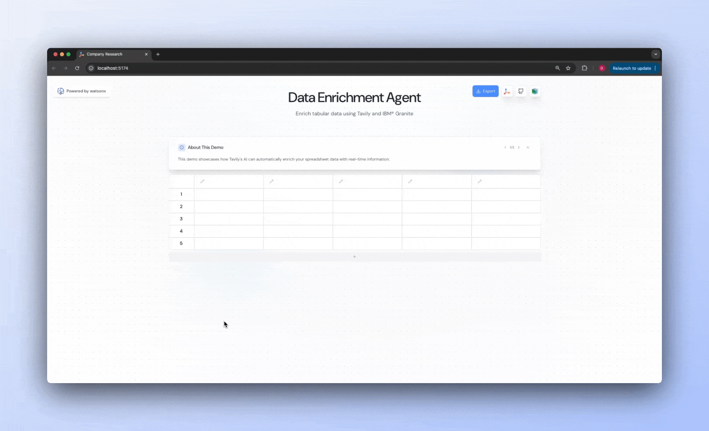
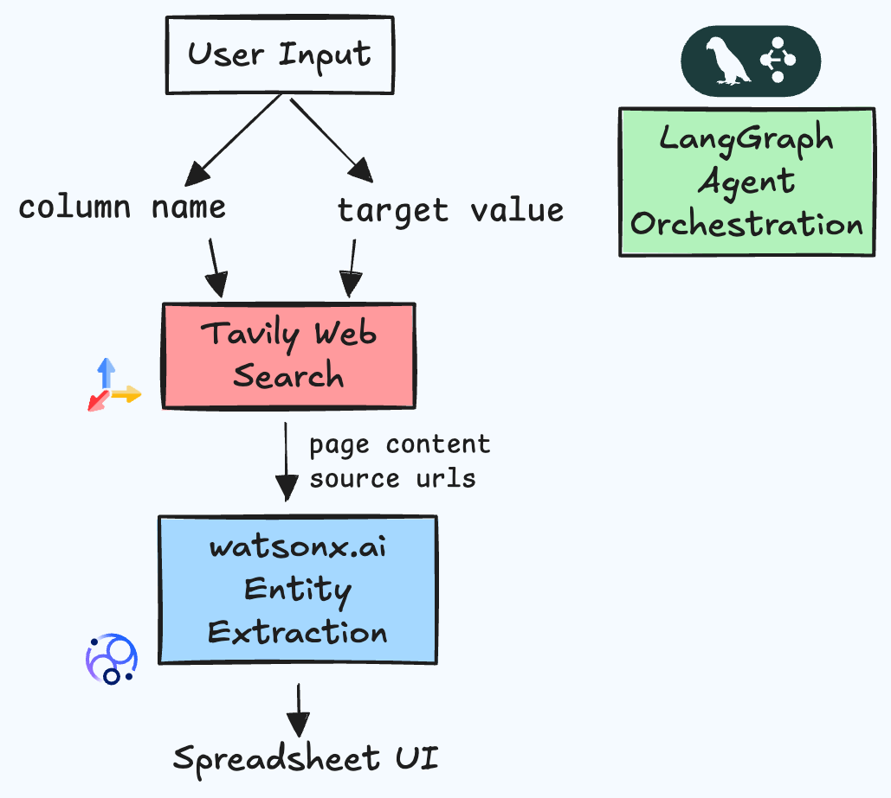

<!-- # watsonx-tavily-spreadsheet -->
<div align="center">
  
  
  <p>Powered by <a href="https://tavily.com">Tavily</a> and <a href="https://www.ibm.com/products/watsonx-ai">IBM® watsonx.ai™</a></p>
</div>

## 🚀 Welcome to the Spreadsheet Enrichment Repository!
This repository offers two key resources to help watsonx developers enhance their AI agents with web access:

1. A three step [tutorial series](./tutorials/README.md) for building research agents with web access and watsonx.

2. An end-to-end solution for building AI-enriched spreadsheets with real-time web access. The application combines [Tavily's](https://tavily.com/) advanced search capabilities with [IBM's watsonx.ai](https://www.ibm.com/products/watsonx-ai) foundation models, specifically the latest [`granite-3-2-8b-instruct`](https://www.ibm.com/granite) model, to transform your business spreadsheets with intelligent web-sourced information.


### Step 1: Fill in spreadsheet columns
<div align="center">
  
</div>

### Step 2: Enrich your spreadsheet
<div align="center">
  
</div>

### Step 3: Export as CSV
<div align="center">
  
</div>

## Features

With this application, you can:
- 📊 Enrich spreadsheet cells with AI-generated content backed by live web data
- 🧠 Entity extraction and data processing with Granite LLMs
- 🔄 Process entire columns in batch for efficient data enhancement
- 📑 Access source citations for all web-sourced information
- 📂 Export your enriched data as CSV files for further use

Designed for ease of customization, you can extend this core implementation to:
- Integrate proprietary data sources
- Modify the agent architecture
- Configure different [watsonx.ai foundation models](https://www.ibm.com/products/watsonx-ai/foundation-models)
- Perform [time-range](https://docs.tavily.com/documentation/api-reference/endpoint/search#body-time-range) or [domain-filtered]((https://docs.tavily.com/documentation/api-reference/endpoint/search#body-include-domains)) search using Tavily's advanced parameters.


## Architecture Diagram


## Setup Instructions

#### API Keys:

This application requires API keys from the following services:
- [Tavily API](https://app.tavily.com/home)
- [IBM watsonx.ai](https://www.ibm.com/products/watsonx-ai)
#### Set up environment variables:

   a. Create a `.env` file in the project's root directory with your API keys:
   ```bash
   TAVILY_API_KEY=<your API key>
   WATSONX_API_KEY=<your API key>
   WATSONX_PROJECT_ID=<your API key>
   WATSONX_URL=<your data center key>
   FOUNDATION_MODEL_ID=<watsonx.ai model id>
   ```
   Note:  `FOUNDATION_MODEL_ID` environment variable is optional for FM selection from watsonx.ai platform. If left empty, the application will use `ibm/granite-3-3-8b-instruct` by default.

   b. Create a `.env.development` file in the `ui` directory with:
   ```bash
   VITE_API_URL=http://localhost:8000
   VITE_WS_URL=ws://localhost:8000
   ```

### Backend Setup
#### Python Virtual Environment
1. Create a virtual environment and activate it:
```bash
python3.11 -m venv venv
source venv/bin/activate  # On Windows: .\venv\Scripts\activate
```

2. Install dependencies:
```bash
python3.11 -m pip install -r requirements.txt
```

3. From the root of the project, run the backend server:
```bash
python app.py
```
#### Docker 

1. Alternatively, build and run the backend using Docker from the root of the project:
```bash
# Build the Docker image
docker build -t spreadsheet .

# Run the container
docker run -p 8000:8000 --env-file .env spreadsheet
```


### Frontend Setup

1. Navigate to the frontend directory:
```bash
cd ui
```

2. Install dependencies:
```bash
npm install
```

3. Start the development server:
```bash
npm run dev
```
4. Launch the app in your browser with http://localhost:5174/

## 📂 Repository Structure

This repository includes everything required to create a functional chatbot with web access:

### 📡 Backend ([`backend/`](./backend))
The core backend logic, powered by LangGraph:
- [`graph.py`](./backend/graph.py) – Defines the agent architecture, state management, and processing nodes.

### 🌐 Frontend ([`ui/`](./ui))
Interactive React frontend for dynamic user interactions and spreadsheet responses.

### Server
- [`app.py`](./app.py) – FastAPI server that handles API endpoint.

---

## API Endpoints

- `POST /api/enrich/batch`: endpoint that handles batched agent execution and spreadsheet population.

## Contributing

Feel free to submit issues and enhancement requests!

## 📞 Contact Us

Have questions, feedback, or looking to build a custom solution? We'd love to hear from you!

- Email our team directly:
  - [Dean Sacoransky](mailto:deansa@tavily.com)
  - [Michael Griff](mailto:michaelgriff@tavily.com)

---

<div align="center">
  
  
  <p>Powered by <a href="https://tavily.com">Tavily</a> and <a href="https://www.ibm.com/products/watsonx-ai">IBM® watsonx.ai™</a> </p>
</div>
